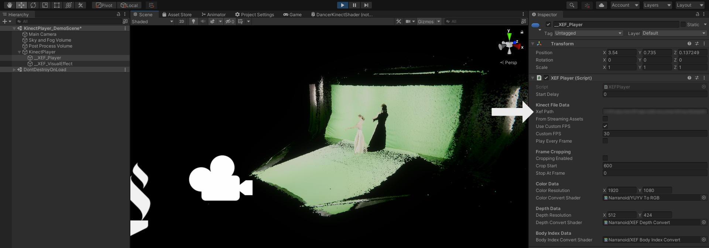

# Unity VFX Kinect Player
A working Kinect XEF file player based on KinectXEFTools and Unity VFX Graph.
In the KinectPlayer_DemoScene, unfold the KinectPlayer prefab and there you can set the path to a XEF file on your device.

Then you can play it in Unity:

## Everywhen
This Kinect XEF player is a cleaned up version of the XEF player created for the project [Everywhen](https://www.mariajudova.net/project/everywhen/):
A 360° video adaptation of an intermedia performance that deals with the topic of historic recurrence through movement, 3d visuals, and sound spatialization

## Visual Effect Features
- **Clipping:** Clipping a certain range of the image
- **Body Index Masking:** Mask by a human body the Kinect detected (usually very good results)
- **Joint Distance Masking:** Mask elements that exceed a certain distance to a joint of the person recorded
- **Keying:** A classic color key / green screen
